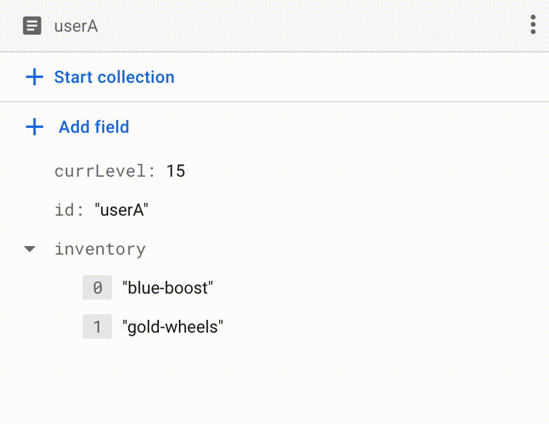

<p dir="auto">
  <a target="_blank" rel="noopener noreferrer" href="https://app.travis-ci.com/ChrisForeman/firestore-repo">
    
  </a>
</p>

# Firestore Repo

A lightweight framework for making DDD with Firestore easier via the repository pattern. 
> Focus less on the which database fields to change and more on business logic.


## Installation

> npm i firestore-repo

## Example - users trading items via firestore transaction

```typescript
const db = new admin.firestore.Firestore()

const data = {
    userAId: 'userA',
    userBId: 'userB',
    userATradeItems: ['gold-wheels'],
    userBTradeItems: []
}

await new UnitOfWorkDefault(db).commit<UserRepo, [User, User]>(context => new UserRepo(context), async userRepo => {

    //Get the users making the trade
    const [userA, userB] = await Promise.all([
        userRepo.get(data.userAId),
        userRepo.get(data.userBId)
    ])

    //Transfer items: userB => userA.
    data.userATradeItems.forEach(name => {
        const item = userA.removeItem(name)
        userB.addItem(item)
    })

    //Transfer items: userA => userB.
    data.userBTradeItems.forEach(name => {
        const item = userB.removeItem(name)
        userA.addItem(item)
    })

    return [userA, userB]

}).then(([userA, userB]) => {
    console.log('Trade result saved to firestore!')
    console.log(`UserA inventory: ${userA.inventory}`)
    console.log(`UserB inventory: ${userB.inventory}`)
})
```

<div class="row" align="center">
    
    
</div>


## [View Documentation](https://github.com/ChrisForeman/firestore-repo/blob/main/docs.md)